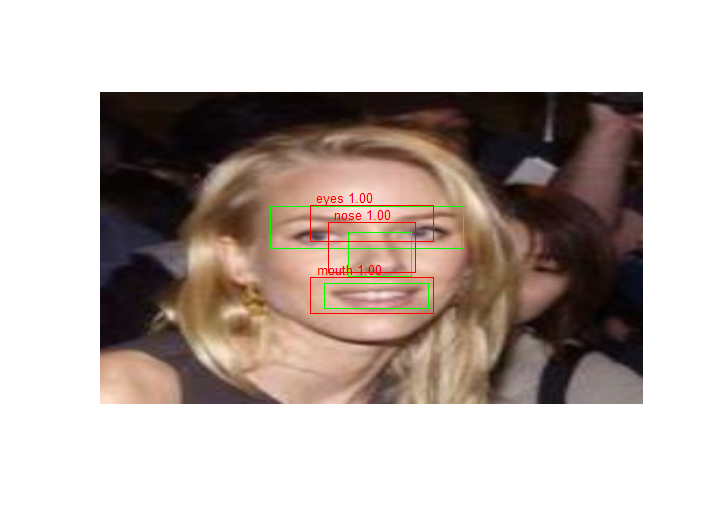

<!-- README.md is generated from README.Rmd. Please edit that file -->
ssdkeras package - Under Construction, use at your own risk
===========================================================

This is a R port to [Pierluigi Ferrari's Python implementation](https://github.com/pierluigiferrari/ssd_keras) of Single Shot Multibox Detector - [SSD](https://arxiv.org/abs/1512.02325).

See how to use it for detecting eyes, nose and mouth on the LFW faces dataset in this post (TODO: link)

Or get the gist with `train_ssd7_faces.R`.

You should get quite good results, e.g.:



As said this is under construction though working at large. Only lightly tested on my Windows machine in which for example Python, Keras, Tensorflow are already installed. Other packages needed:

`tidyverse`, `stringr`, `reticulate`, `magick`

See `sessionInfo()`:

``` r
sessionInfo()
```

    ## Warning in readLines("~/sessionInfo_04122017.txt"): incomplete final line
    ## found on '~/sessionInfo_04122017.txt'

    ## R version 3.4.1 (2017-06-30)
    ## Platform: x86_64-w64-mingw32/x64 (64-bit)
    ## Running under: Windows 7 x64 (build 7601) Service Pack 1
    ## 
    ## Matrix products: default
    ## 
    ## locale:
    ## [1] LC_COLLATE=English_United States.1252  LC_CTYPE=English_United States.1252   
    ## [3] LC_MONETARY=English_United States.1252 LC_NUMERIC=C                          
    ## [5] LC_TIME=English_United States.1252    
    ## 
    ## attached base packages:
    ## [1] stats     graphics  grDevices utils     datasets  methods   base     
    ## 
    ## other attached packages:
    ##  [1] bindrcpp_0.2     dplyr_0.7.2      purrr_0.2.3      readr_1.1.1      tidyr_0.6.3      tibble_1.3.3    
    ##  [7] ggplot2_2.2.1    tidyverse_1.1.1  magick_1.5       stringr_1.2.0    keras_2.0.9.9000
    ## 
    ## loaded via a namespace (and not attached):
    ##  [1] reticulate_1.3        reshape2_1.4.2        haven_1.1.0           lattice_0.20-35       colorspace_1.3-2     
    ##  [6] yaml_2.1.14           base64enc_0.1-3       rlang_0.1.1           foreign_0.8-69        glue_1.1.1           
    ## [11] modelr_0.1.1          readxl_1.0.0          jpeg_0.1-8            bindr_0.1             plyr_1.8.4           
    ## [16] tensorflow_1.4.1.9000 munsell_0.4.3         gtable_0.2.0          cellranger_1.1.0      rvest_0.3.2          
    ## [21] psych_1.7.5           knitr_1.16            forcats_0.2.0         tfruns_1.0            parallel_3.4.1       
    ## [26] broom_0.4.2           Rcpp_0.12.13          scales_0.5.0          jsonlite_1.5          mnormt_1.5-5         
    ## [31] bmp_0.2               hms_0.3               png_0.1-7             stringi_1.1.5         animation_2.5        
    ## [36] grid_3.4.1            tools_3.4.1           magrittr_1.5          lazyeval_0.2.0        whisker_0.3-2        
    ## [41] readbitmap_0.1-4      pkgconfig_2.0.1       zeallot_0.0.6         xml2_1.1.1            lubridate_1.6.0      
    ## [46] imager_0.40.2         assertthat_0.2.0      httr_1.2.1            R6_2.2.2              nlme_3.1-131         
    ## [51] compiler_3.4.1
